---

# 🛡️ Contactical: TEE-Powered DePIN Infrastructure

> **"Verified Spatial Truth via Hardware-backed Root of Trust"**
> 안드로이드 StrongBox(TEE)와 Cosmos SDK를 결합하여 물리적 무결성이 보장된 공간 데이터 경제와 자율 기계 법인의 토대를 구축합니다.

---

## 🌟 Vision: The Internet of Trust

기존의 LBS(위치 기반 서비스)는 소프트웨어 스푸핑과 데이터 오염에 취약합니다. Contactical은 실리콘 레벨의 보안을 블록체인의 투명성으로 연결하여, 인간의 개입 없이도 **'기계가 스스로 벌고 스스로 유지하는(Self-maintenance)'** 자율 경제 주체 모델을 지향합니다.

---

## 🏗️ System Architecture

Contactical은 **"Edge-to-Blockchain"** 보안 무결성을 위해 4개의 독립 계층으로 설계되었습니다.


---

## 🛠️ Technical Deep Dive

### 1. Hardware Root of Trust (TEE/StrongBox)

단순한 소프트웨어 보안을 넘어 제조사(Google/Samsung)가 보증하는 **Key Attestation**을 강제합니다.

* **Certificate Chain Verification:** 기기가 제출한 인증서 체인이 제조사 Root CA까지 이어지는지 온체인에서 검증합니다.
* **Verified Boot:** 부트로더 잠금 해제 기기를 실시간 탐지하여 하드웨어 탈취 시도를 원천 차단합니다.

### 2. High-Performance Go SDK Integration

`os/exec`를 통한 외부 CLI 호출 방식의 병목을 해결하기 위해 **Cosmos SDK 소스 레벨 직접 연동**을 구현했습니다.

* **성능 향상:** 트랜잭션 처리 지연 시간(Latency) **90% 단축**.
* **비보관형(Non-custodial):** 프록시는 개인키에 접근하지 않으며 서명된 트랜잭션의 유효성 검증 및 릴레이 역할만 수행합니다.

### 3. Deterministic Fixed-Point Math

블록체인 합의의 핵심인 '결정론적 연산'을 위해 모든 위경도 데이터를 정수형으로 처리합니다.

* **공식:** 

* **정밀도:** 위도 당 약 **11cm**의 해상도 확보 (자율주행 및 정밀 관제 가능 수준).
* **효율성:** 부동 소수점 대비 **가스 소비량 85% 절감**.

---

## 📈 Economy & Resilience Engineering

### 1. SBT & Reputation (TACT)

* **SBT (Soulbound Token):** 기기 신분증을 통해 시빌 공격(Sybil Attack) 방어.
* **TACT (Trust Tier):** 시간 감쇠()가 적용된 평판 알고리즘으로 노드 정직성 수치화.

### 2. Entropy-based Decentralization

네트워크의 중앙화를 막기 위해 **샤넌 엔트로피(Shannon Entropy)**를 측정합니다.

* **항상성 유지:** 지분 집중도가 높아지면(엔트로피 감소) 자동으로 분산 가중치()를 조절하여 자발적 탈중앙화를 유도합니다.

### 3. Modular Verifier Interface (Future-Proof)

* **Fork-less Upgrade:** 인터페이스 설계를 통해 양자 내성 암호(PQC)나 영지식 증명(ZKP) 도입 시 하드 포크 없이 검증 로직 추가 가능.

---

## 🗺️ Roadmap: The Path to Autonomy

* **Phase 1 (Current):** 메인넷 인프라 안정화 및 하드웨어 보안 체계 구축.
* **Phase 2:** **ZKP(영지식 증명)** 도입을 통한 프라이버시 보호 위치 증명.
* **Phase 3:** AI 데이터 마켓플레이스 연동 및 **Machine Economy** 활성화.
* **Phase 4:** 양자 내성(PQC) 확보 및 글로벌 IBC 상호운용성 달성.

---

## 🏛️ Philosophy: Engineered Coexistence

> **"기술은 본성을 이길 수 없지만, 본성이 흐르는 물길은 바꿀 수 있습니다."**
> Contactical은 인간의 효율성 추구(탐욕)가 시스템의 안정성(공존)으로 흐르도록 수학적 중력을 설계했습니다. 우리는 기계가 부를 창출하고 인간은 그 가치를 누리는 새로운 사회 계약을 엔지니어링합니다.

---

## 📂 Directory Structure

```bash
.
├── proto/           # Protobuf definitions (gRPC/Msg)
├── x/reality/       # Main Blockchain Logic (Keeper/Types)
├── proxy/           # High-Performance Go Relayer
├── android/         # TEE/StrongBox Signature App
└── dashboard/       # Real-time Visualization (FastAPI/React)

```

---

## 🚀 Getting Started

```bash
# Chain Initialization
ignite chain serve

# Proxy Start (Port 9095)
go run proxy/main.go

# AI Dashboard Run
python dashboard/app.py

```

---