# 🛡️ Contactical: TEE-Powered DePIN Infrastructure

> **"Hardware-backed Proof of Spatial Truth"**
> 안드로이드 TEE(Trusted Execution Environment)와 Cosmos SDK 블록체인을 결합한 조작 불가능한 공간 데이터 네트워크

## 🌟 Project Overview

Contactical은 현대 공간 데이터 시장의 신뢰 문제를 해결하기 위해 탄생했습니다. 소프트웨어 스푸핑이나 GPS 조작이 불가능한 **하드웨어 기반 신뢰(Root of Trust)**를 구축하고, 기여도에 따라 공정하게 보상하는 DePIN(Decentralized Physical Infrastructure) 플랫폼입니다.

### 🎯 Key Achievements

* **Android TEE(StrongBox) 연동:** 기기 내부 격리 영역에서 생성된 서명으로 데이터 무결성 확보.
* **High-Performance Proxy:** Go SDK 직접 연동을 통해 CLI 대비 **처리 속도 10배 향상**.
* **Flexible Scoring Engine:** 소프트 포크 없이 거버넌스로 보안 가중치를 조절하는 유연한 아키텍처.
* **Real-time Trust Map:** 검증된 노드의 신뢰도를 실시간 히트맵으로 시각화.

---

## 🏗️ System Architecture

Contactical은 하드웨어의 물리적 진실을 블록체인의 경제적 가치로 연결합니다.



---

## 🛠️ Technical Deep Dive

### 1. Hardware Root of Trust

단순한 소프트웨어 선언이 아닌, 제조사가 보증하는 **Key Attestation**을 사용합니다. 이를 통해 기기가 실제 물리적 StrongBox 칩을 보유하고 있는지, 부트로더가 잠겨 있는지를 수학적으로 증명합니다.

### 2. High-Performance Non-Custodial Relayer

`os/exec`를 통한 CLI 호출 방식을 버리고, **Go SDK 직접 연동** 방식을 택했습니다. 기기가 TEE 내에서 직접 서명한 데이터를 프록시가 수수료만 대납하며 릴레이하는 구조로, 보안과 성능을 모두 잡았습니다.

### 3. Gas-Efficient Fixed-Point Math

블록체인 내부 연산의 효율성을 위해 위경도 데이터를 정수형으로 변환하여 처리합니다.


소수점 6자리 정밀도를 유지하며 가스비 오버헤드를 최소화했습니다.

---

## 🔐 Security Audit

본 프로젝트는 메인넷 수준의 가용성을 위해 8가지 공격 시나리오를 설계하고 방어 로직을 구축했습니다.

* **A. Key Extraction:** StrongBox 기반 추출 불가능한 키 생성 강제.
* **B. Attestation Spoofing:** 제조사 Root CA까지 이어지는 인증서 체인 검증.
* **C. Replay Attack:** Timestamp 검증 및 데이터 해시 중복 제거.
* **D. Gas/DoS Attack:** 메시지 크기 제한 및 데이터량 비례 가스 미터링 적용.
* **E. Liveness Failure:** Casper FFG 기반의 합의 연속성 보장.

---

## 🗺️ User Scenarios & Roadmap

* **자율주행 정밀 지도:** 위변조 불가능한 도로 상황 데이터 공급처.
* **재난 관제:** #SOS 태그 기반의 실시간 현장 인증 시스템.
* **Phase 2 (Roadmap):** 영지식 증명(ZKP) 도입을 통한 프라이버시 보호 위치 증명 구현.

---

## 🚀 How to Run

```bash
# 1. Chain 가동
ignite chain serve

# 2. 고성능 프록시 실행 (포트 9095)
go run proxy/main.go

# 3. 대시보드 가동
uvicorn main:app --port 8000

```
